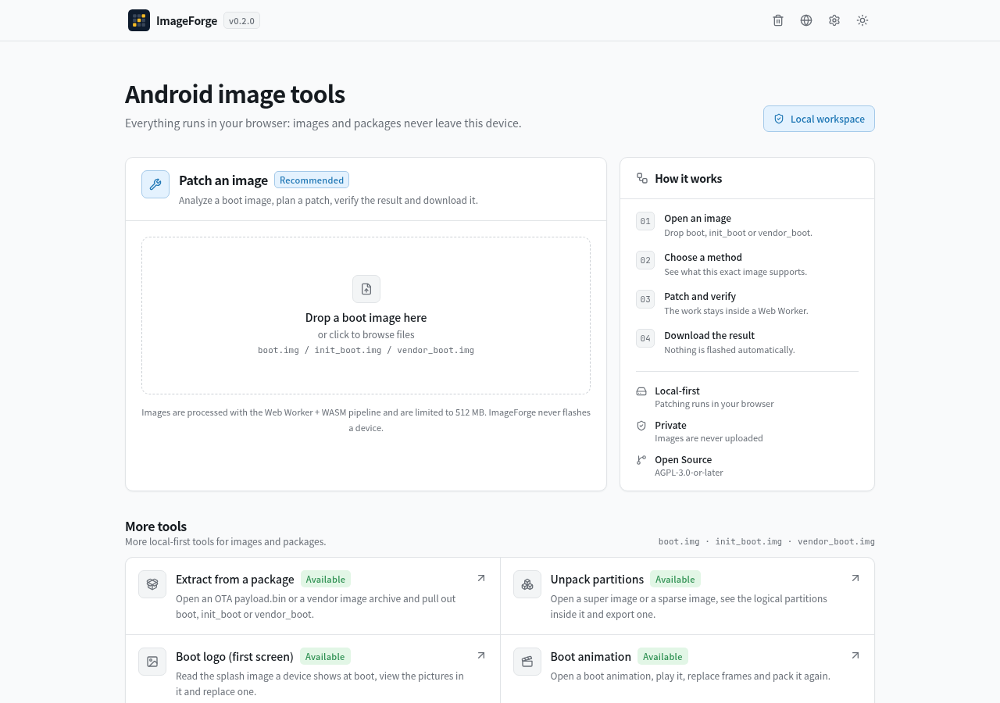
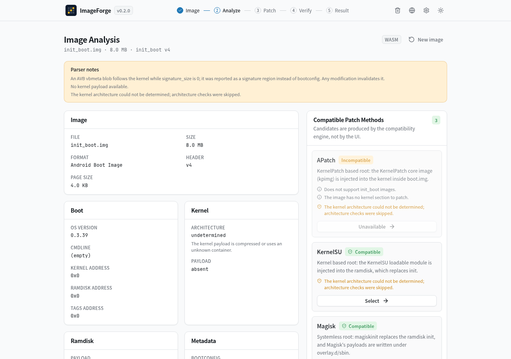

# ImageForge

**A tool for Android boot images that runs in your browser.** Patch one with Magisk, KernelSU,
APatch or a fork of any of them; open an OTA package and take a partition out of it; browse what is
inside a `super` or `erofs` or `ext4` image; compare two images; edit the boot logo or the boot
animation; and see what a file actually is before you touch it.

<picture>
  <source media="(prefers-color-scheme: dark)" srcset="docs/images/tools-dark.png">
  
</picture>

There is no server, no account and no telemetry. The parsers, the patchers and the codecs run in a
Web Worker inside the page, with WebAssembly for the parts that need it or that are upstream C
compiled as it is. **Nothing is uploaded, and nothing is flashed**: a run ends at a file you
download.

Repository: <https://github.com/LyraVoid/ImageForge>

## The tools

| Tool | What it is for | State |
| --- | --- | --- |
| **Patch an image** | Analyse a boot image, pick a patch method, plan the patch, run it in the worker, verify the result and download it. Five managers of the KernelSU family, three KernelPatch core images and three Magisk-family managers are supported | available |
| **Extract from a package** | Open an OTA `payload.bin` or a vendor archive (an 8 GB package is read in ranges, never loaded whole) and pull out `boot`, `init_boot`, `vendor_boot` or any other entry | available |
| **Unpack partitions** | Open a `super` image and its logical partitions, a sparse image, `erofs` or `ext4`; browse in ranges, read a file out of it, and write sparse and `super` images back out | available |
| **Boot logo** | Read a splash image (OPPO/Realme/OnePlus) or a MediaTek logo image, look at the pictures in it, and replace one | available |
| **Boot animation** | Open a `bootanimation.zip`, play it, replace frames, edit `desc.txt` and pack it again | available |
| **Compare images** | Diff two files and see which section of a boot image each difference falls in | available |
| **Inspect** | Read-only: what a file is, what it holds, what already patched it | available |

## Which managers it can patch for

A patch only works with the manager app that trusts it, because each rebuild of the payloads is
compiled against its own signing certificate. That is why this is a choice rather than a fixed list:
the plan records the manager, and the result page links to the release page of its app.

| Family | Managers | The image needs |
| --- | --- | --- |
| KernelPatch (kernel patch) | APatch, Aster, FolkPatch | `me.bmax.apatch`, `me.yuki.aster` or `me.yuki.folk` |
| KernelSU (ramdisk + module) | KernelSU, SukiSU, ReSukiSU, YukiSU, KowSU | the matching app, for example `me.weishu.kernelsu` |
| Magisk (ramdisk) | Magisk, WeaveMask, MagisKube | `com.topjohnwu.magisk`, `io.github.seyud.weave` or `org.magiskube.magisk` |

## Why you can trust what comes out

Every byte-level format here was implemented against a reference, not against recollection, and the
claims the project makes are the ones its tests can check:

* **The ramdisk a patch produces is byte for byte the one the official app writes** — Magisk's own
  output for the same source image, and KernelSU's. The reference liblz4 and bzip2 are compiled to
  WebAssembly rather than reimplemented, and a device ramdisk re-encodes to the bytes the stock image
  shipped.
* **The KernelPatch core images reproduce what their own releases produce**, checked against each
  branch's native `kptools` binary with the browser build, byte for byte.
* **Sparse and `super` images are compared with AOSP's `img2simg`, `lpmake`, `lpdump` and
  `lpunpack`**, and the `erofs` and `ext4` readers against `sha256sum` output taken on a device.
* **Every bundled binary is digest verified before it is used**, registered with a pinned upstream
  revision and its licence record, and held to what it claims to be — a module is a relocatable ELF
  whose `vermagic` matches the device KMI, a core image starts with `KP1158`, a stub is an APK.
* **Nothing is verified against this project's own output.** When a reference exists it is read and
  cited, or compiled and run, or used as an oracle. [docs/architecture.md](docs/architecture.md)
  explains the order and lists the bugs each one found.

Where a byte-level contract exists but real material to check it does not, the record says so instead
of implying more: each manager's licence record in [THIRD_PARTY_LICENSES/](THIRD_PARTY_LICENSES/README.md)
ends with what has *not* been verified yet.

## Getting it

    git clone https://github.com/LyraVoid/ImageForge && cd ImageForge
    pnpm install
    pnpm dev          # development server on http://127.0.0.1:5173/
    pnpm build        # tsc -b && vite build, a static site in dist/
    pnpm preview      # serve the production build
    pnpm verify       # docs check, typecheck, lint, tests, build — the gate

Requirements: **Node 22.13+ and pnpm 11** (the exact pnpm is pinned in `package.json` as
`packageManager`, so `corepack enable` or a recent pnpm picks it up). Rebuilding the Rust module
needs a Rust toolchain with the `wasm32-unknown-unknown` target; the other WebAssembly modules are
built by `scripts/` from pinned upstream releases. All compiled modules are committed, so neither
toolchain is needed just to run or develop the app.

It is a static site, and the paths inside it are absolute — the service worker, the manifest and the
WebAssembly modules are fetched from `/`, `/wasm` and `/artifacts` — so serve `dist/` from the root
of a domain rather than a subdirectory. After the first visit the app works offline.

## What it can read

| Format | What it does here |
| --- | --- |
| Boot image header v0–v4 | parse, extract, repack, verify; `boot`, `init_boot` and `vendor_boot` |
| Kernel containers | uncompressed, gzip, LZ4 (frame or legacy, dependent blocks included), xz |
| Ramdisk | CPIO `newc`/`crc`, gzip/LZ4/xz containers, produced the way `magiskboot` writes them |
| `super` images | liblp metadata, logical partitions and their extents; built the way `lpmake` does |
| Sparse images | AOSP chunk types, whole-file or streamed; built the way `img2simg` does |
| `erofs` | superblock, inodes, LZ4-compressed files, in ranges |
| `ext4` | superblock, extent trees, directories, in ranges |
| Zip and OTA packages | zip64, an 8 GB `payload.bin` read in ranges, `REPLACE`, `REPLACE_XZ` and `REPLACE_BZ` |
| Splash and MediaTek logo images | parse, decode the frames, replace one, repack |
| Boot animations | `desc.txt` (vendor dialects included) and the part directories, repacked as a stored zip |

Anything a reader does not understand it refuses with an error of its own, and damaged input is part
of the test suite rather than an afterthought.

## Before you flash anything

ImageForge never touches a device: it hands you a file, and what you do with it is yours. Writing a
patched image to the wrong partition, or one built for a different device or kernel, can leave a phone
unable to boot. Keep a stock copy of every partition you patch, know how to restore it with fastboot,
and read the checklist on the result page — it names the partition, the manager app the image needs,
and the fact that the AVB signature is gone. [docs/usage.md](docs/usage.md) is the user guide.

## Limits, on purpose

* **A KernelPatch core image can also be supplied by hand**, and a KernelSU or Magisk module supplied
  by the user overrides the bundled one. Both are checked before use — the core image for the
  KernelPatch magic, the module by its `.modinfo` and the kernel it was built for.
* **The AVB signature is dropped** on repack, so verified boot fails unless the image is re-signed or
  verification is disabled.
* **Remote artifact downloads are not implemented**: only artifacts bundled with the build (digest
  verified) can be resolved, which is what keeps the tool usable offline and auditable.
* **No writer for `erofs` or `ext4`**, and no KernelPatch LKM route. Each would need a device to be
  verified against, so neither is pretended.

## Project

    src/core/      image engine, patch engine, artifact registry, compatibility, errors
    src/workers/   worker protocol and session
    src/wasm/      module loader, TypeScript fallback, WASI runner, digest registry
    src/routes/    the pages; src/components/ the design system; src/i18n/ four languages
    crates/        the Rust crate compiled to WebAssembly
    scripts/       reproducible builds, the icon generator, the material table, the payload scanner
    public/        bundled WebAssembly modules, manager payloads, icons, service worker
    tests/         unit, integration, worker, wasm and interface tests
    docs/          architecture, testing material, user guide
    THIRD_PARTY_LICENSES/  upstream licences, digests and integration policy

`pnpm verify` is the gate; [docs/testing.md](docs/testing.md) lists the material the strongest tests
need, where each one looks, and the environment variable that supplies it. Tests that need material
skip themselves and say so, so the suite is honest about what did not run.
[CONTRIBUTING.md](CONTRIBUTING.md) has the rules that matter, including how to add a manager, and
[SECURITY.md](SECURITY.md) says how to report something sensitive.

## License

ImageForge is licensed under **AGPL-3.0-or-later**: see [LICENSE](LICENSE) and [NOTICE](NOTICE). If
you run a modified version as a network service, the AGPL asks you to offer its source to the people
using it.

Third-party code keeps its own licence and is never re-licensed. Every bundled binary is registered
with its upstream revision, licence text and digest in
[THIRD_PARTY_LICENSES/](THIRD_PARTY_LICENSES/README.md). The projects whose releases are bundled are
named for provenance only: ImageForge is an independent project and is **not affiliated with, endorsed
by or sponsored by** Magisk, KernelSU, APatch, KernelPatch or any of the managers listed in
[NOTICE](NOTICE).
